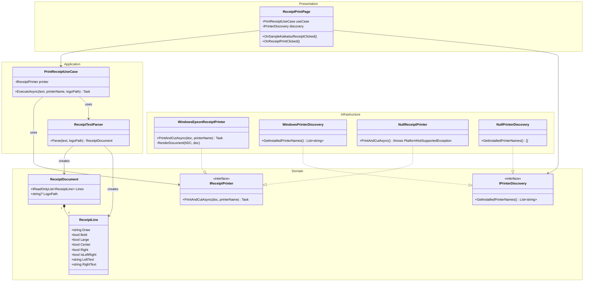
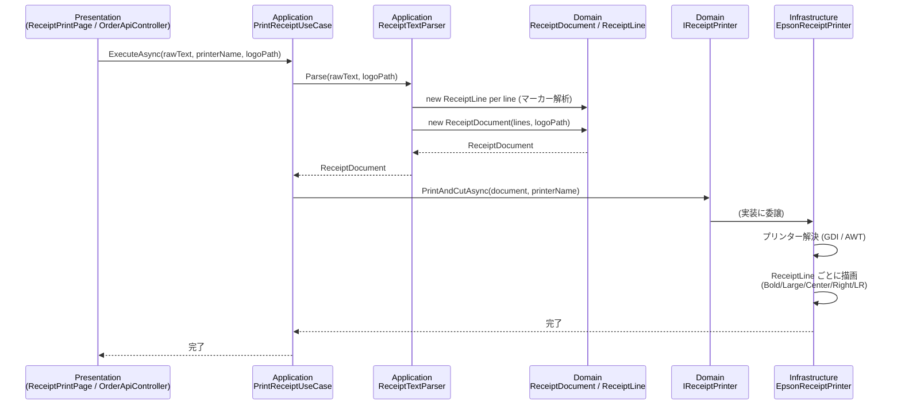
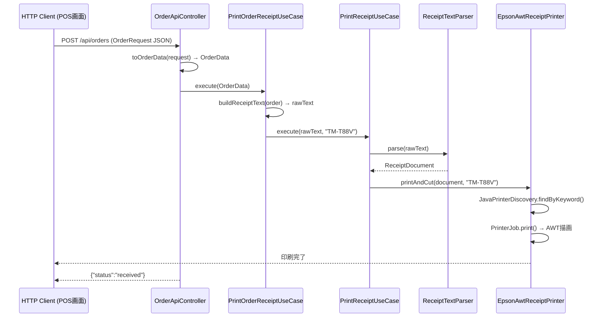

# レシート印刷機能 クリーンアーキテクチャ設計

MauiApp1 と spring_webapp1 の共通アーキテクチャを示す。

---

## クラス図



---

## シーケンス図（共通 印刷フロー）



---

## シーケンス図（spring_webapp1 固有 注文→レシート）



---

## ファイル構成

### MauiApp1

```
MauiApp1/
├── Domain/Printing/
│   ├── ReceiptLine.cs          ← 値オブジェクト（マーカー解析済み1行）
│   ├── ReceiptDocument.cs      ← 値オブジェクト（レシート全体）
│   ├── IReceiptPrinter.cs      ← ポート（印刷）
│   └── IPrinterDiscovery.cs    ← ポート（プリンター列挙）
├── Application/Printing/
│   ├── ReceiptTextParser.cs    ← マーカー付きテキスト → ReceiptDocument
│   └── PrintReceiptUseCase.cs  ← ユースケース
├── Infrastructure/Platform/
│   ├── WindowsEpsonReceiptPrinter.cs  ← IReceiptPrinter 実装 (GDI)
│   ├── WindowsPrinterDiscovery.cs     ← IPrinterDiscovery 実装 (WinSpool)
│   ├── NullReceiptPrinter.cs          ← 非Windows用スタブ
│   └── NullPrinterDiscovery.cs        ← 非Windows用スタブ
└── Presentation/Pages/Receipt/
    └── ReceiptPrintPage.xaml.cs       ← PrintReceiptUseCase + IPrinterDiscovery を注入
```

### spring_webapp1

```
com.example.spring_webapp1/
├── domain/printing/
│   ├── ReceiptLine.java         ← 値オブジェクト（マーカー解析済み1行）
│   ├── ReceiptDocument.java     ← 値オブジェクト（レシート全体）
│   ├── IReceiptPrinter.java     ← ポート（印刷）
│   └── IPrinterDiscovery.java   ← ポート（プリンター列挙）
├── application/printing/
│   ├── ReceiptTextParser.java   ← マーカー付きテキスト → ReceiptDocument
│   └── PrintReceiptUseCase.java ← ユースケース
├── application/order/
│   ├── OrderData.java           ← アプリケーション層 DTO
│   ├── OrderItemData.java       ← アプリケーション層 DTO
│   └── PrintOrderReceiptUseCase.java ← 注文→レシートテキスト変換＋印刷
├── infrastructure/printing/
│   ├── EpsonAwtReceiptPrinter.java  ← IReceiptPrinter 実装 (Java AWT)
│   └── JavaPrinterDiscovery.java    ← IPrinterDiscovery 実装 (PrintServiceLookup)
└── presentation/
    ├── OrderApiController.java  ← HTTP → OrderData → PrintOrderReceiptUseCase
    └── OrderPageController.java ← /order → static HTML
```
