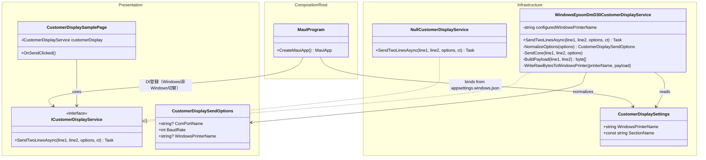
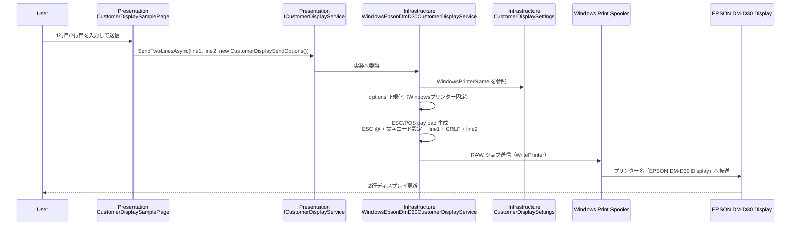

# カスタマーディスプレイ出力方針

今回の構成では、**出力先機器（EPSON DM-D30 Display）を Infrastructure レイヤが管理**し、利用側（Page / ViewModel / 呼び出し元）は機器名や接続方式を意識しない設計にしている。  
`CustomerDisplaySamplePage` は「表示したい 2 行テキスト」を `ICustomerDisplayService` に渡すだけでよく、どのプリンターへどう送るか（Windows スプーラ RAW、Shift_JIS 変換、ESC/POS 組み立て）は `WindowsEpsonDmD30CustomerDisplayService` に閉じ込める。  
これにより UI 側の責務を軽く保ち、将来の機器差し替えや送信方式変更も Infrastructure 実装の差し替えで吸収できる。

---

## クラス図（MauiApp1 カスタマーディスプレイ）

---

## シーケンス図（2行表示送信フロー）

---

## 関連モジュール一覧（登場箇所）

- `MauiApp1/Presentation/Pages/Receipt/CustomerDisplaySamplePage.xaml.cs`  
  - 利用側。UI 入力を受けて `ICustomerDisplayService` を呼ぶ。
- `MauiApp1/Presentation/Services/ICustomerDisplayService.cs`  
  - ポート定義（`CustomerDisplaySendOptions` を含む）。
- `MauiApp1/Infrastructure/Platform/WindowsEpsonDmD30CustomerDisplayService.cs`  
  - 機器名の確定、ESC/POS 組み立て、Windows スプーラ RAW 送信を担当。
- `MauiApp1/Infrastructure/Configuration/CustomerDisplaySettings.cs`  
  - 環境依存設定（`CustomerDisplay:WindowsPrinterName`）の受け皿。
- `MauiApp1/appsettings.windows.json`  
  - 実環境の機器名（`EPSON DM-D30 Display`）を保持。
- `MauiApp1/MauiProgram.cs`  
  - 設定バインドと DI 登録（Windows: 実装 / 非Windows: Null 実装）。
